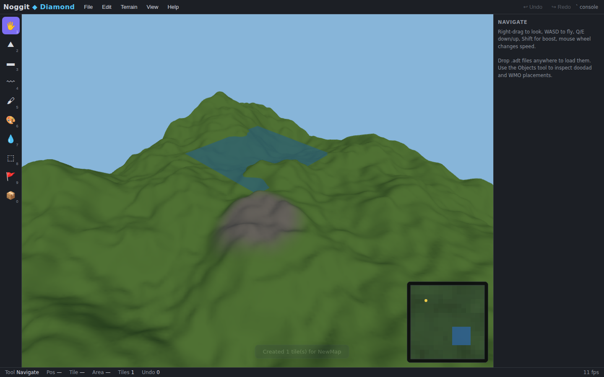

# Noggit ◆ Diamond

**A modern, browser-based map editor for World of Warcraft 3.3.5a (WotLK) — the classic
[Noggit](https://gitlab.com/prophecy-rp/noggit) rebuilt from the ground up.**

Noggit Diamond reads and writes real WotLK ADT terrain files and gives you sculpting,
texture painting, water, holes, area ids, vertex shading, object placement, procedural
generation, heightmap round-tripping and full undo — running in any modern browser,
with zero installation, on Windows, macOS and Linux.



## Why a new Noggit?

The classic Noggit (and its forks) are 15-year-old C++/OpenGL codebases that are hard to
build, Windows-centric, crash-prone, and famously weak at undo. Noggit Diamond keeps the
workflow map-makers know and fixes the foundations:

| | Classic Noggit | **Noggit Diamond** |
|---|---|---|
| Platform | Windows build (fragile) | Any browser — or native desktop builds for Windows/macOS/Linux |
| Undo/redo | Partial, unreliable | Every stroke, transactional (200 steps) |
| File safety | Can corrupt unknown chunks | Byte-preserving round trip, unknown chunks kept verbatim |
| WDL (distant terrain) | Never updated → far-view mismatch | Regenerated automatically on save |
| Procedural terrain | — | Seeded simplex fBm/ridged/islands, seamless across tiles |
| Heightmap import/export | — | PNG + lossless 16-bit PGM |
| Scripting | Lua (Red fork only) | JavaScript console with a typed `nd` API |
| Alpha maps | 2048/4096 | 4-bit, 8-bit ("big alpha") **and** RLE-compressed, auto-detected |
| Tests | none | 121 unit tests incl. byte-idempotent serialization |

## Features

**Terrain** — raise/lower, flatten (raise-only / lower-only / locked height), smooth;
seven classic brush falloffs (flat, linear, smooth, polynomial, trigonometric, quadratic,
gaussian) with inner-radius control. Edits are seamless across chunk *and* tile borders,
and normals are recomputed automatically after every stroke.

**Texturing** — paint up to 4 layers per chunk with pressure/opacity control, automatic
layer management, empty-layer pruning, texture swapping, per-chunk layer inspector, and a
palette that can be "skinned" with your own PNG/JPG previews of the real BLPs.

**Water (MH2O)** — flood/drain per chunk with river/ocean/magma/slime types, level
control (absolute or relative to terrain), full support for multi-instance cells, exists
bitmaps, depth maps and all four liquid vertex formats.

**Detail** — MCCV vertex-color shading, terrain holes, area-id painting, impassable
flags, baked-shadow display, area/impass overlays, wireframe mode.

**Objects** — inspect, select, move (terrain-snapping drag), rotate, re-scale and delete
M2 doodad and WMO placements; MCRF reference tables are kept consistent.

**World** — multi-tile editing with automatic seam stitching, minimap with click-to-
teleport, WDT map index maintenance, WDL low-res heightmap regeneration on save.

**Generation** — seeded procedural terrain (rolling hills / ridged mountains / islands)
that lines up perfectly across tiles; heightmap import from any grayscale image and
lossless 16-bit PGM export/import for external tools (Blender, Gaea, World Machine…).

**Scripting** — press <kbd>`</kbd> for the Diamond Script console: drive every editing
operation from JavaScript (`nd.raise`, `nd.paint`, `nd.water`, `nd.generate`,
`nd.heightAt`, …) for repeatable, scriptable map work.

## Quick start

**In the browser:**

```bash
npm install
npm run dev          # → http://localhost:5173
```

**As a desktop app** (Electron — native window, native save dialogs, works offline):

```bash
npm install
npm run dist:linux   # → release/NoggitDiamond-<version>-linux-x86_64.AppImage
npm run dist:win     # → release/NoggitDiamond-Setup-<version>.exe (+ portable .exe)
npm run dist:mac     # → release/NoggitDiamond-<version>-mac-<arch>.dmg
```

Each `dist:*` command must run on its own OS (or use the **Desktop builds** GitHub
Actions workflow, which packages all three from one click / on version tags).
For development, `npm run build && npm run app` launches the desktop shell directly,
and `npm run dev` + `npm run app:dev` gives hot reload inside the native window.

**With Visual Studio (Windows):** open **`NoggitDiamond.sln`** and press
**Build** — Debug produces `release\win-unpacked\Noggit Diamond.exe`, Release
produces the NSIS installer + portable exe; F5 launches the app. Needs the
*JavaScript and TypeScript development* workload and Node.js on PATH — see
[docs/VISUAL_STUDIO.md](docs/VISUAL_STUDIO.md).

* **File ▸ New Map…** creates flat or procedural tiles from scratch.
* Or **drop `.adt` files** (ideally together with the map's `.wdt`) into the viewport.
  Extract them from your client's MPQs with any MPQ tool (Ladik's MPQ Editor, etc.).
* Edit with tools <kbd>1</kbd>–<kbd>0</kbd>, then **File ▸ Save All** to download the
  edited ADTs plus regenerated WDT and WDL, ready to pack back into a patch MPQ.

```bash
npm test             # 121 unit tests (format round-trip, editing ops, generation)
npm run typecheck    # strict TypeScript
npm run build        # production bundle in dist/
```

## Controls

| Input | Action |
|---|---|
| RMB drag | Look around |
| W A S D / Q E | Fly / down / up (Shift = boost, wheel = speed) |
| LMB | Apply active tool |
| Ctrl + LMB | Inverted tool (lower / erase / drain / fill) |
| 1 – 0 | Select tool |
| Ctrl+Z / Ctrl+Y | Undo / redo |
| Ctrl+S | Save current tile |
| ` | Scripting console |
| R / Delete | Rotate / delete selected object |

## Project layout

```
src/lib/        Pure TypeScript library (no DOM) — fully unit-tested
  binary/       Chunked little-endian reader/writer
  adt/          ADT parser, serializer, alpha codecs, blank-tile builder
  wdt/  wdl/    Map index + low-res world heightmaps
  edit/         Sculpt, texture, water, holes, areas, normals, undo
  gen/          Simplex noise, procedural terrain, heightmap I/O
  world/        Multi-tile Terrain facade (spatial queries, seams)
src/app/        Browser editor (Three.js renderer, tools, UI)
docs/           User guide and format notes
```

The `src/lib` layer has no browser dependencies and doubles as a standalone
ADT toolkit — see [docs/FORMATS.md](docs/FORMATS.md).

## Format support

WotLK **3.3.5a monolithic ADTs** (version 18): MVER, MHDR, MCIN, MTEX, MMDX/MMID,
MWMO/MWID, MDDF, MODF, MH2O (all LVFs), MFBO, MTXF, and per-chunk MCVT, MCCV, MCNR
(incl. the 13 preserved pad bytes), MCLY, MCRF, MCSH, MCAL (4-bit, 8-bit, compressed),
MCLQ (preserved verbatim), MCSE. Unknown chunks survive load→save byte-for-byte.
WDT and WDL are fully supported. Cataclysm+ split files are out of scope.

Model files (M2/WMO geometry) live inside MPQs and are rendered as markers, not meshes —
Diamond is a terrain editor first; see [docs/USER_GUIDE.md](docs/USER_GUIDE.md).

## License

[MIT](LICENSE). Not affiliated with Blizzard Entertainment. World of Warcraft is a
trademark of Blizzard Entertainment, Inc. Use with game data you are licensed to use.
